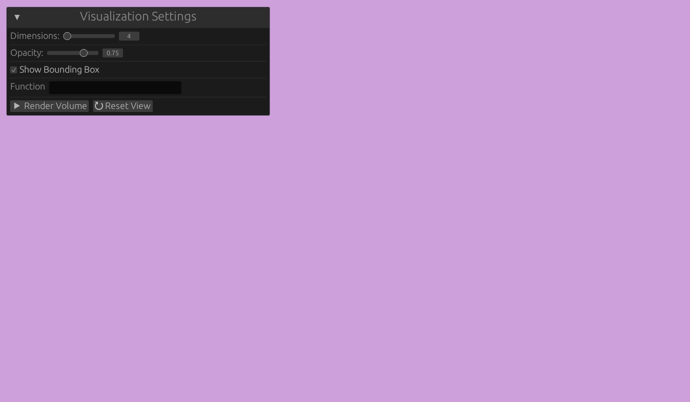

# Zobrazovanie viacrozmerných funkcií na GPU

Študent: **Bc. Adrián Kocifaj**  
Školiteľ: **Mgr. Andrej Mihálik, PhD**

Diplomová práca, ktorej cieľom je navrhnúť a implementovať systém na vizualizáciu viacrozmerných funkcií. Pre zobrazenie funkcií s viacerými dimenziami je nutné použiť iné vlastnosti, ako sú farba, priehľadnosť a ďalšie. Zložitosť výpočtu vyžaduje paralelnosť a rýchlosť grafických kariet, to umožní aj zobrazenie komplexných objektov v interaktívnom prostredí.

Zdrojový kód aplikácie: [Zdrojový kód](code/) \
Diplomová práca (aktuálna verzia): [Diplomová práca](docs/master_thesis.pdf) \
Prezentácia (Projektový seminár 2): [Prezentácia](docs/presentation.pdf)

### **01.10.2025 – 31.10.2025**
- [x] **Štúdium vybraných vedeckých článkov.**
- [x] **Implementácia základnej verzie aplikácie.**
    - Použitie Silk.NET OpenGL.
    - Základná fungujúca verzia aplikácie.
    - Implementácia:
        - Priestorová obálka.
        - Kamera a pohyb v priestore.
        - Výpočet viacrozmených funkcíí v compute shaderi.

### **01.11.2025 – 30.11.2025**
- [x] **Dokončenie implemetácia a experimentovanie so zobrazovaním.**
    - Implementácia používateľského rozhrania pomocou ImGui.
    - Interakcia s používateľským rozhraním a vizualizáciou.

- [x] **Písanie práce.**
    - Východiska práce.
    - Výskumná časť práce.

### **01.12.2025 – 12.12.2025**
- [x] **Zverejnenie postupu a ďalších informácií na GitHub.**
    - Zverejnenie aktuálneho postupu práce, [kódu](code/) a textu [diplomovej práce](docs/master_thesis.pdf) na GitHub. Usporiadanie a nastavenie repozitára.
- [x] **Vypracovanie a príprava na prezentáciu.**
    - Vytvorenie [prezentácie](docs/presentation.pdf) na predmet Projektový seminár 2 a príprava na jej odprezentovanie.